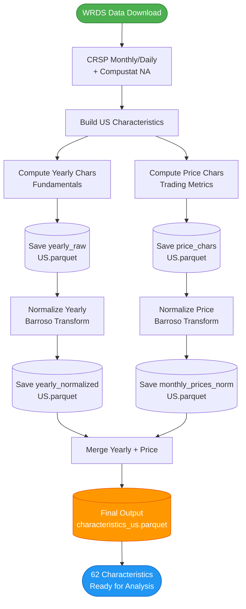

# Freyberger 62 Characteristics


This repository replicates the **62 firm characteristics** from [Freyberger, Neuhierl, & Weber (2020)](https://doi.org/10.1093/rfs/hhz123) using a Polars LazyFrame architecture for memory-efficient processing of large datasets. The pipeline constructs characteristics for US equities using CRSP and Compustat North America data.

**Data Access**: Requires a [WRDS (Wharton Research Data Services)](https://wrds-www.wharton.upenn.edu/) subscription to download CRSP and Compustat NA datasets.


## Features

- **Polars LazyFrame Architecture**: Memory-efficient processing of massive datasets
- **62 Firm Characteristics**: Complete replication of Freyberger et al. (2020)
- **Normalization**: [Barroso, Saxena, & Wang (2025)](https://ssrn.com/abstract=5046369) rank normalization
- **Pixi Environment Management**: Reproducible, cross-platform environments

## Quick Start

(For detailed step-by-step check the `instructions.md` file)

### 1. Install Pixi

This repository uses [pixi](https://pixi.sh), a fast package and environment manager built in Rust that ensures reproducibility across platforms.

To install pixi:

```bash
# Windows (PowerShell)
iwr -useb https://pixi.sh/install.ps1 | iex

# Windows (Terminal)
powershell -ExecutionPolicy ByPass -c "irm https://pixi.sh/install.ps1 | iex"

# macOS/Linux
curl -fsSL https://pixi.sh/install.sh | bash
```

### 2. Install Dependencies
To set up the environment, run in terminal:

```bash
pixi install
```
This will create the environment `data_collection`. To activate the environment just do:

```bash
pixi shell
```

## Pipeline Architecture

The following diagram illustrates the complete data processing pipeline from raw WRDS data to final normalized characteristics:



### Pipeline Stages

1. **Data Download** (`download_data.py`)
   - Connects to WRDS and downloads raw data
   - Downloads US data (CRSP/Compustat NA)

2. **Characteristic Construction** (`characteristics.py`)
   - **Yearly Characteristics**: Fundamentals-based (Investment, Profitability, Value)
   - **Price Characteristics**: Trading-based (Returns, Beta, Volatility, Liquidity)

3. **Normalization** (`normalization.py`)
   - Applies Barroso et al. (2025) rank transformation
   - Winsorization → Imputation → Rank scaling to [-0.5, 0.5]

4. **Merge & Output** (`construction/merge.py`)
   - Combines yearly and price characteristics
   - Produces final parquet files

## 62 Characteristics

The repository reproduces the next 62 characteristics (For full detail of the computation of these characteristics, check the `characteristics.md`)

### Past Returns (IDs 1-5)
- **r2_1**: Short-term reversal (1-month)
- **r6_2**: Return months 6-2
- **r12_2**: Standard momentum (12-2 months)
- **r12_7**: Intermediate momentum
- **r36_13**: Long-term reversal

### Investment (IDs 6-11)
- **Investment**: Asset growth
- **ACEQ**: Change in book equity
- **DPI2A**: Change in PP&E + inventory
- **AShrout**: Share issuance
- **IVC**: Inventory change
- **NOA**: Net operating assets ratio

### Profitability (IDs 12-28)
- **ATO, CTO**: Asset turnover ratios
- **EPS, IPM, PCM, PM**: Earnings/margin metrics
- **Prof, RNA, ROA, ROC, ROE, ROIC**: Profitability ratios
- **SAT, S2C**: Sales ratios

### Intangibles (IDs 29-32)
- **AOA, OA**: Accruals
- **OL**: Operating leverage
- **Tan**: Tangibility

### Value (IDs 33-47)
- **BEME**: Book-to-market
- **A2ME, C, Q**: Asset/value ratios
- **E2P, S2P, Debt2P**: Price multiples
- **Free_CF, LDP, NOP**: Cash flow/payout
- **Sales_g**: Sales growth

### Trading (IDs 48-62)
- **Beta, Beta_Cor, Idio_vol**: Risk metrics
- **LME, LTurnover, DTO**: Size/liquidity
- **Spread, Std_Turn, Std_Vol**: Trading costs
- **Rel2High, Ret_max, Total_vol**: Price patterns

## Project Structure

```
characteristics_repo/               # Project root
├── data_collection/                # Python package
│   ├── __init__.py                 # Package exports
│   ├── config.py                   # Variable mappings
│   ├── data_loader.py              # Data ingestion with Polars LazyFrames
│   ├── cleaners.py                 # Filters: share codes, exchange codes
│   ├── characteristics.py          # Main CharacteristicBuilder class
│   ├── normalization.py            # Barroso et al. (2025) logic
│   └── construction/
│       ├── __init__.py
│       ├── prices.py               # Momentum, volatility, beta
│       ├── fundamentals.py         # Ratios: BEME, ROA, Investment
│       └── merge.py                # Price + Funda merge (FF timing)
├── main.py                         # CLI driver script
├── download_data.py                # WRDS data download script
├── pixi.toml                       # Pixi environment config
├── README.md                       # This file
├── instructions.md                 # Step-by-step guide
├── .env.example                    # Environment variable template
└── .gitignore
```

## Output Files

| File | Description |
|------|-------------|
| `characteristics_raw_us.parquet` | US raw characteristics |
| `characteristics_normalized_us.parquet` | US rank-normalized |

## Normalization

Per Barroso, Saxena, & Wang (2025) Appendix A.1:

1. **Impute** missing values with cross-sectional median
2. **Rank transform** within each date
3. **Scale** to [-0.5, 0.5]

## CLI Options

```bash
python main.py --help

Options:
  --no-normalize            Skip normalization
  --data-dir PATH           Override data directory
  --output-dir PATH         Override output directory
  --quiet                   Suppress progress messages
  --validate-only           Only validate paths
```

## Development

```bash
# Run tests
pixi run test

# Lint code
pixi run lint

# Format code
pixi run format

# Interactive shell
pixi shell
```

## References

- Freyberger, S., Neuhierl, A., & Weber, M. (2020). Dissecting Characteristics Nonparametrically. *Review of Financial Studies*, 33(5), 2326-2377.
- Barroso, P., Saxena, K., & Wang, X. (2025). Appendix A.1 - Characteristic Normalization.

## License

MIT License - See LICENSE file for details.
